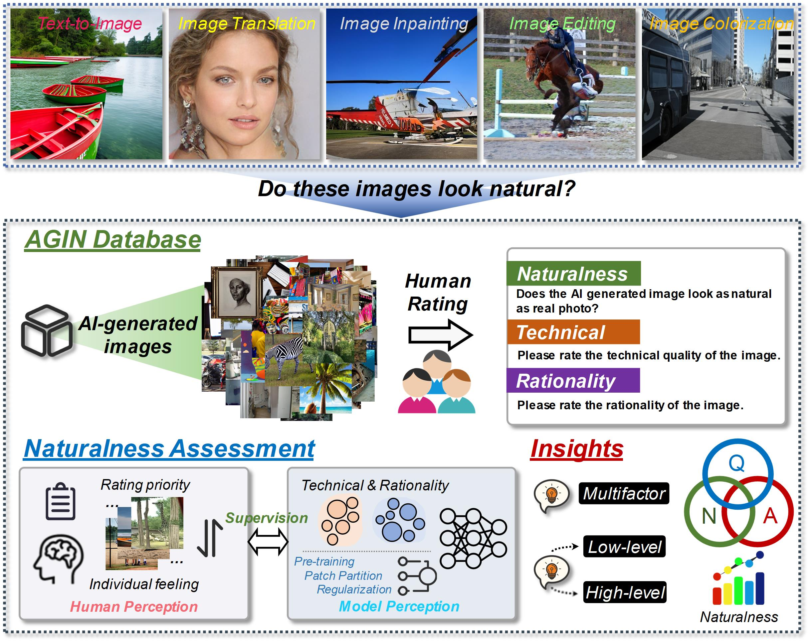

<div align="center">

<div>
<a href="https://github.com/zijianchen98/AGIN"></a>
    <a href="https://github.com/zijianchen98/AGIN"></a>
    <a href="http://arxiv.org/abs/2312.05476"></a>
    <a href="https://ieeexplore.ieee.org/document/10771738"></a>
    <a href="https://github.com/zijianchen98/AGIN"></a>
    <a href="https://github.com/zijianchen98/AGIN"></a>
</div>

<h1>Exploring the Naturalness of AI-Generated Images</h1>

_Do AI-generated Images look natural?_

<div>
    <a href="https://scholar.google.com.hk/citations?hl=zh-CN&user=NSR4UkMAAAAJ" target="_blank">Zijian Chen</a><sup>1</sup>,
    <a href="https://scholar.google.com.hk/citations?hl=zh-CN&user=nDlEBJ8AAAAJ" target="_blank">Wei Sun</a><sup>1*</sup>,
    <a href="https://scholar.google.com.hk/citations?hl=zh-CN&user=wth-VbMAAAAJ" target="_blank">Haoning Wu</a><sup>2</sup>,
    <a href="https://scholar.google.com.hk/citations?hl=zh-CN&user=QICTEckAAAAJ" target="_blank">Zicheng Zhang</a><sup>1</sup>,
    <a href="https://scholar.google.com.hk/citations?hl=zh-CN&user=QICTEckAAAAJ" target="_blank">Jun Jia</a><sup>1</sup>,
    <a href="https://scholar.google.com.hk/citations?hl=zh-CN&user=QICTEckAAAAJ" target="_blank">Ru Huang</a><sup>3</sup>,
    <a href="https://minxiongkuo.github.io/" target="_blank">Xiongkuo Min</a><sup>1</sup>,
    <a href="https://ee.sjtu.edu.cn/FacultyDetail.aspx?id=24&infoid=66&flag=66" target="_blank">Guangtao Zhai</a><sup>1*</sup>,
    <a href="https://ee.sjtu.edu.cn/FacultyDetail.aspx?id=14&infoid=66&flag=66" target="_blank">Wenjun Zhang</a><sup>1</sup>
</div>

<div>
  <sup>1</sup>Shanghai Jiao Tong University, <sup>2</sup>Nanyang Technological University, <sup>3</sup>East China University of Science and Technology, 
</div>   

<div>
<sup>*</sup>Corresponding authors. 
   </div>

<a href="https://ieeexplore.ieee.org/document/10771738"><strong>Paper</strong></a>

<div style="width: 80%; text-align:center; margin:auto;">
</div>

</div>

> Abstract: We take the first step to benchmark and assess the visual naturalness of AI-generated images. First, we construct the **AI-Generated Image Naturalness (AGIN) database** by conducting a large-scale subjective study to collect human opinions on the **overall naturalness** as well as perceptions from **technical and rationality perspectives**. AGIN verifies that naturalness is universally and disparately affected by both technical and rationality distortions. Second, we propose the **Joint Objective Image Naturalness evaluaTor (JOINT)**, to automatically learn the naturalness of AGIs that aligns human ratings. Specifically, JOINT imitates human reasoning in naturalness evaluation by jointly learning both technical and rationality perspectives. Experimental results show our proposed JOINT significantly surpasses baselines for providing more subjectively consistent results on naturalness assessment.


# AI-Generated Image Naturalness (AGIN) Database

## Introduction
The proposed AGIN includes two perspectives for naturalness assessment: technical (T) and rationality (R), each of which contains 5 dimensions:

- For technical perspective (T), we consider specific image attributes (_**Luminance**, **Contrast**_) that have high correlations of naturalness. _**Detail**, **Blur**_ and a common issue introduced by generative models _(**Artifacts**)_ are also considered.
- For rationality perspective (R), we contribute 5 new factors: _**Existence**_, _**Color**_, _**Layout**_, _**Context**_, and _**Sensory Clarity**_ to evaluate the rationality of AI-generated images.
- Please refer to our paper for more detailed explaination.


## Database Downloads
OneDrive and Baidu Netdisk are available now!

* OneDrive: [downloading link](https://1drv.ms/u/c/0c2191cb01cbf002/EQLwywHLkSEggAzSCQAAAAABnn9ICRkAnM9YuSRtAWoDLQ?e=Jidlia)
* Baidu Netdisk: [downloading link](https://pan.baidu.com/s/1DWZEMH6fPndaD9UhJbylMQ) (password: riha)

## Calculate the Naturalness of your AIGI

### Environments
- Requirements:
```
torch(>=2.1.0), torchvision, pandas, ptflops, numpy, Pillow
```
- Create a new environment
```
conda create -n JOINT python=3.11
conda activate JOINT 
conda install pytorch torchvision torchaudio pytorch-cuda=12.4 -c pytorch -c nvidia
pip install pandas ptflops numpy
```

Detect the regions containing artifacts and generate the partitioned patch:
```shell
git clone https://github.com/zijianchen98/AGIN.git
cd JOINT
```
- put the evaluated image into `demo` folder
- Download the [checkpoint](https://pan.sjtu.edu.cn/web/share/2f767ea67e14ddbb491476742a6158f8) (code: ubaj) for artifacts detection and put it into `../tools/PAL4VST-main/deployment/pal4vst/swin-large_upernet_unified_512x512/`

```shell
cd utils
python patch_partition.py
```

Use [JOINT](https://github.com/zijianchen98/AGIN) to automatically evaluate the naturalness of AI-generated images:

```shell
python test_single_image.py --model_path ./savedir/JOINT_2024.pth --model JOINT --image_path ./demo/CoCosNet_23.png --resize 384 --crop_size 224 --gpu_ids 0
```

Please download the provided trained [model](https://1drv.ms/u/c/0c2191cb01cbf002/Ec_lncCxGZZCnjocT40-sn0B5Srg0zFn6H-95EopvxJIzQ?e=taiT9R) into the `savedir` folder before execute the above command

## Collecting AI-generated Images
The adopted image generation methods and related works are listed in another repository [Awesome-AI-Generated-Image-Tasks](https://github.com/zijianchen98/Awesome-AI-Generated-Image-Tasks)

## Contact

Please contact the first author of this paper for queries.

- Zijian Chen, `zijian.chen@sjtu.edu.cn`

## Citation
Please feel free to cite our paper if you use the AGIN database in your research:
```
@article{chen2023exploring,
  title={Exploring the Naturalness of AI-Generated Images},
  author={Chen, Zijian and Sun, Wei and Wu, Haoning and Zhang, Zicheng and Jia, Jun and Min, Xiongkuo and Zhai, Guangtao and Zhang, Wenjun},
  journal={arXiv preprint arXiv:2312.05476},
  year={2023}
}
@article{chen2024study,
  author={Chen, Zijian and Sun, Wei and Wu, Haoning and Zhang, Zicheng and Jia, Jun and Huang, Ru and Min, Xiongkuo and Zhai, Guangtao and Zhang, Wenjun},
  journal={IEEE Transactions on Circuits and Systems for Video Technology}, 
  title={Study of Subjective and Objective Naturalness Assessment of AI-Generated Images}, 
  year={2024},
  volume={},
  number={},
  pages={1-1},
  keywords={AI-generated images;image naturalness assessment;image quality assessment;dataset},
  doi={10.1109/TCSVT.2024.3509032}}
```

## Acknowledgement

We thank the authors in paper ["Perceptual Artifacts Localization for Image Synthesis Tasks"](https://openaccess.thecvf.com/content/ICCV2023/papers/Zhang_Perceptual_Artifacts_Localization_for_Image_Synthesis_Tasks_ICCV_2023_paper.pdf), which enables us to localize the artifacts in AI-generated images.
